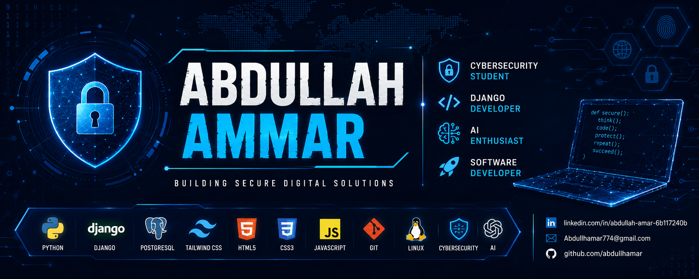

# ABDULLAH AMMAR

---

# 👋 About Me

Information Security Graduate with a strong interest in Cybersecurity, Backend Development, and Secure Software Engineering.

I specialize in designing and developing secure web applications, information management systems, and cybersecurity-focused solutions using modern technologies and best practices.

My work focuses on building scalable systems, enhancing information security, and leveraging technology to solve real-world challenges.

### Current Focus

* 🔐 Cybersecurity & Information Security
* 💻 Django Backend Development
* 🌐 Secure Web Applications
* 🗄️ Database Design & Management
* 📊 System Analysis & Design
* 🤖 AI-Assisted Software Development

---

# ⚡ Technology Stack

---

# 🚀 Featured Projects

## 🔐 Security Information Integration Platform

Graduation Project developed for the Criminal Investigation Department.

A centralized platform designed to integrate security information from multiple sources, improve operational efficiency, enhance reporting capabilities, and support data-driven decision-making.

### Technologies

* Django
* PostgreSQL
* REST API
* Tailwind CSS
* Security Information Management

---

## 🔍 Security Log Analyzer

A Python-based security monitoring tool that analyzes security logs, detects suspicious activities, identifies failed authentication attempts, and detects SQL Injection attacks.

### Technologies

* Python
* Regular Expressions
* Security Monitoring
* Threat Detection
* Log Analysis

---

## 🌍  Starlink Account Management System (SAMS)

A desktop-based enterprise management system developed using C# and Oracle Database to support Starlink service operations and customer administration.

The system centralizes customer management, employee administration, billing operations, support ticket handling, reporting, and user access control within a single platform, improving operational efficiency and data organization.

### Key Features

* Employee Management
* Customer Management
* Billing & Subscription Tracking
* Support Ticket Management
* Reporting & Auditing
* Authentication & Authorization
* User Account Administration

### Technologies

* C#
* Windows Forms
* Oracle Database 10g
* SQL
* Oracle Managed Data Access

---

# 💼 Experience Highlights

* Developed a graduation project for a governmental security environment.
* Built multiple web applications using Django and PostgreSQL.
* Designed secure database-driven systems.
* Developed cybersecurity tools and automation scripts using Python.
* Experienced in system analysis, software documentation, and technical reporting.
* Worked on digital transformation and information management solutions.

---

# 🎯 Professional Interests

* Cybersecurity
* Information Security
* Secure Software Development
* Backend Development
* Digital Transformation
* System Analysis & Design
* Artificial Intelligence Applications
* Security Monitoring & Threat Detection

---

# 🏆 Certifications & Professional Development

* Artificial Intelligence Programs
* Cybersecurity & Information Security Training
* ICDL Certification
* Training Of Trainers (TOT)
* AI ERA Global Camp Participant
* National Robotics & AI Championship Participant
* AINarabic Initiative Contributor

---

# 📊 GitHub Statistics

---

# 🔥 GitHub Streak

---

# 🏅 GitHub Trophies

---

# 📈 Contribution Activity

---

# 🌐 Connect With Me

---

## 🔐 Building Secure Systems & Digital Solutions

### Turning Ideas into Secure, Scalable, and Impactful Software

